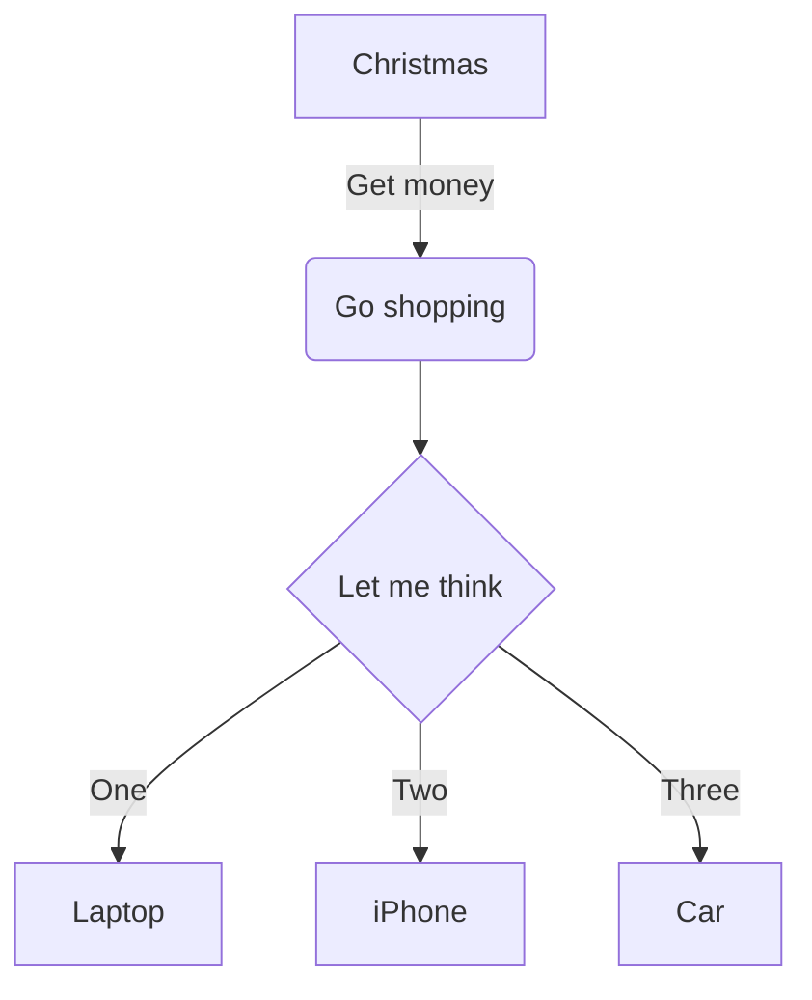
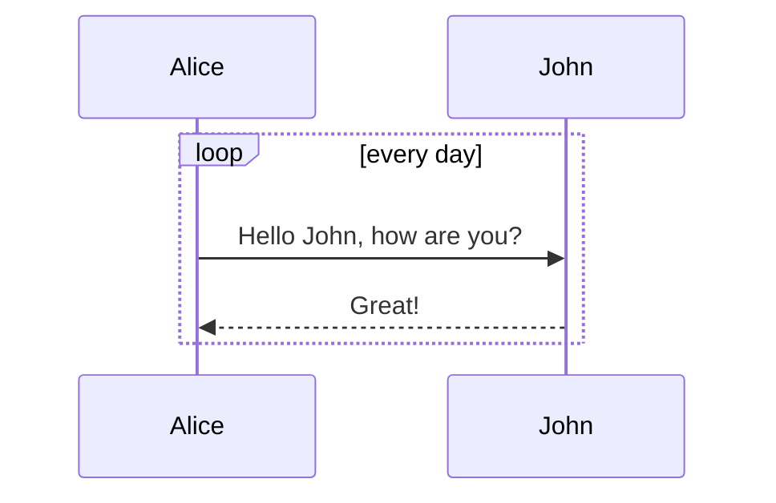
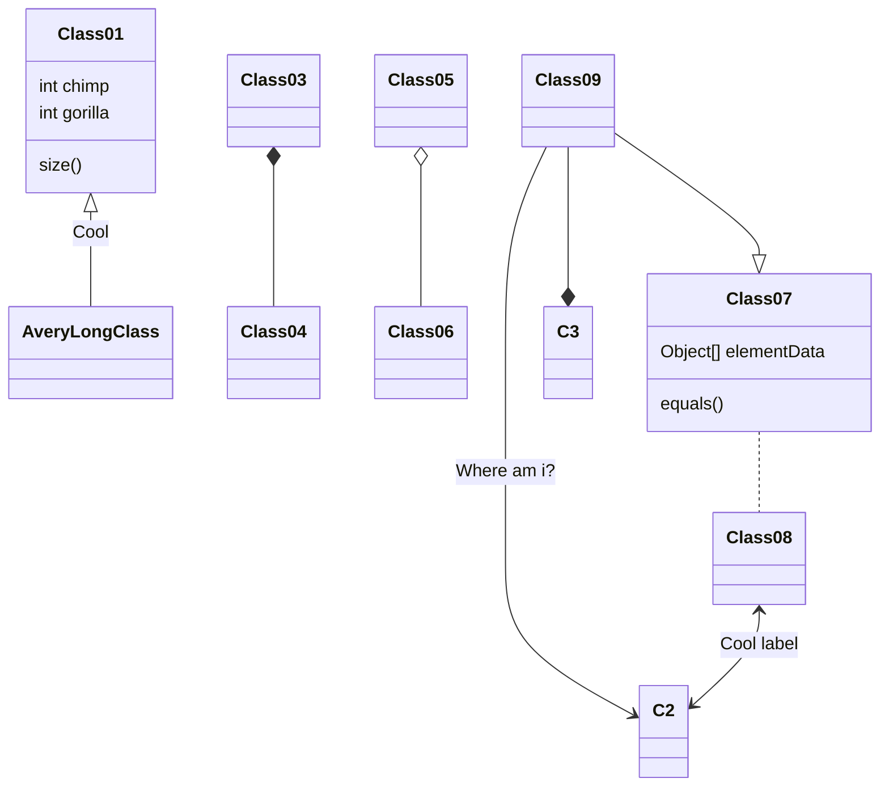

# Mermaid graphs

## Flowchart

```mermaid
graph TD
A[Christmas] -->|Get money| B(Go shopping)
B --> C{Let me think}
C -->|One| D[Laptop]
C -->|Two| E[iPhone]
C -->|Three| F[Car]
```

## Sequence diagram

```mermaid
sequenceDiagram
loop every day
    Alice->>John: Hello John, how are you?
    John-->>Alice: Great!
end
```

## Class diagram

```mermaid
classDiagram
Class01 <|-- AveryLongClass : Cool
Class03 *-- Class04
Class05 o-- Class06
Class07 .. Class08
Class09 --> C2 : Where am i?
Class09 --* C3
Class09 --|> Class07
Class07 : equals()
Class07 : Object[] elementData
Class01 : size()
Class01 : int chimp
Class01 : int gorilla
Class08 <--> C2: Cool label
```
