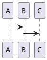
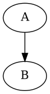

# PlantUML

```puml
A -> B
```





```plantuml format="png" classes="uml myDiagram" alt="My super diagram placeholder" title="My super diagram" width="300px" height="300px"
  Goofy ->  MickeyMouse: calls
  Goofy <-- MickeyMouse: responds
```
